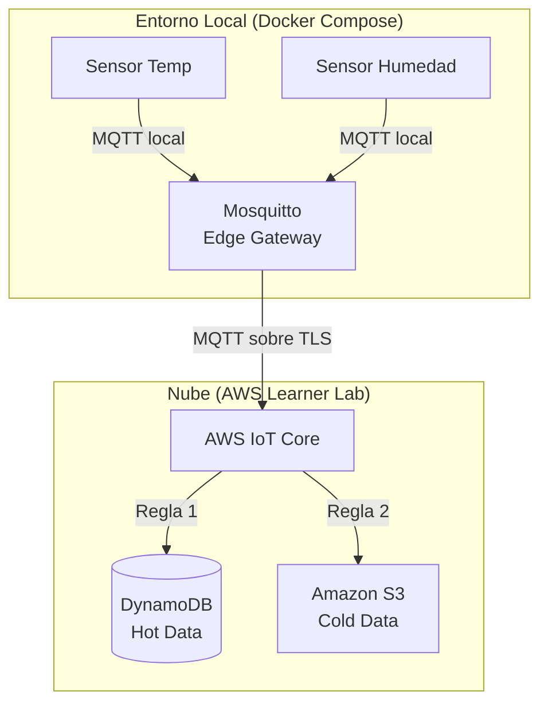
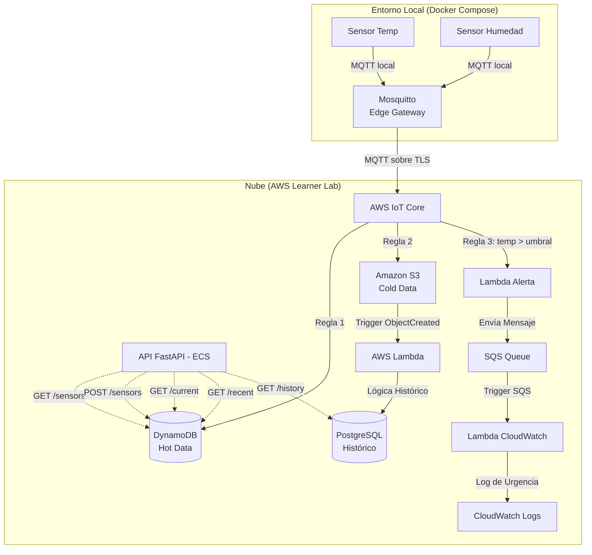

# Laboratorio Base: Edge Gateway (Docker) -> AWS IoT Core -> DynamoDB y S3

Este es el proyecto **BASE** que demuestra una arquitectura IoT usando el patrón **Edge Gateway**. 
A partir de este código, el objetivo práctico es que los alumnos evolucionen la infraestructura hasta convertirla en una Plataforma SaaS completa.

## Arquitectura Actual (Laboratorio Base)

Actualmente, el sistema simula múltiples sensores que envían datos por red local a un servidor Edge (Mosquitto MQTT). El Edge Gateway actúa como puente y reenvía los datos a **AWS IoT Core** usando certificados TLS. Desde ahí, los datos se enrutan simultáneamente a DynamoDB (Hot Data) y a S3 (Cold Data).



---

## Reto Práctico: Evolucionar a un Ecosistema IoT Completo

Como actividad integradora, deberás tomar esta arquitectura base y escalarla añadiendo una Capa de Lógica de Negocio y una API REST unificada.

### Arquitectura Objetivo

Al finalizar las actividades, tu arquitectura debe verse exactamente como el siguiente diagrama, incorporando una base de datos documental (MongoDB), procesamiento sin servidor y una API en ECS:



### Actividades a Realizar

Para llegar a la Arquitectura Objetivo, debes completar los siguientes hitos usando Terraform y código local:

1. **Añadir MongoDB:**
   Modificar la infraestructura para aprovisionar una base de datos MongoDB. Configurar los accesos correspondientes.
   
2. **Crear y Conectar AWS Lambda:**
   Crear una función Lambda en Python que se active automáticamente cuando un nuevo archivo JSON llegue al bucket de S3 (Trigger `s3:ObjectCreated:*`).

3. **Lógica de Mantenimiento Histórico en Lambda:**
   Programar la Lambda para que lea el JSON de S3 y lo inserte en **MongoDB** para mantener el histórico completo de los eventos de cada sensor.

4. **Desarrollar una API REST Unificada:**
   Construir una API (por ejemplo, con FastAPI) que exponga los siguientes endpoints:
   - `GET /sensors`: Lista todos los sensores existentes.
   - `POST /sensors`: Agrega un nuevo sensor.
   - `GET /sensor/{id}/current`: Obtiene el dato en tiempo real consultando **DynamoDB**.
   - `GET /sensor/{id}/recent`: Obtiene los últimos 10 eventos consultando **DynamoDB**.
   - `GET /sensor/{id}/history`: Consulta el histórico completo en **PostgreSQL**.

5. **Desplegar la API en ECS (AWS):**
   Contenedorizar la API con un `Dockerfile` y modificar la infraestructura (Terraform) para desplegarla en AWS Elastic Container Service (ECS), asegurando que corra en la nube en lugar de usar el `docker-compose.yml` local.

6. **Implementar Sistema de Alertas de Urgencia:**
   - Crear una `Regla 3` en AWS IoT Core que evalúe si la temperatura reportada supera un umbral crítico definido por ustedes (ej. `value > 35`).
   - La regla debe disparar una **Lambda de Alerta**, la cual enviará un mensaje con el formato de emergencia a una **Cola SQS**.
   - Configurar la cola SQS como *trigger* de una segunda **Lambda**, la cual consumirá el mensaje y escribirá un log de urgencia en **CloudWatch Logs**.

7. **Sustentación: Agregar un Nuevo Tipo de Sensor:**
   - Modificar con anterioridad el script `python_device/sensor_simulator.py` para soportar un nuevo tipo de sensor de libre elección (diferente a temperatura y humedad).
   - Durante la sustentación, demostrar la adición de este nuevo contenedor al archivo `docker-compose.yml`.
   - Registrar el nuevo sensor en el sistema utilizando el endpoint `POST /sensors`.
   - Verificar la correcta ingesta de datos probando los endpoints de lectura (`GET /sensor/{id}/current`, etc.) para obtener sus valores.

---

*(Debajo de esta línea se encuentran las instrucciones originales para ejecutar y probar el Laboratorio Base)*

---

## Requisitos
- Terraform instalado.
- Docker y Docker Compose instalados.
- Credenciales del AWS Learner Lab configuradas (ej. `~/.aws/credentials`).

---

## Paso 1: Desplegar Infraestructura Base en AWS

Usar el `Makefile` para automatizar el proceso.

1. Abrir la terminal en esta carpeta.
2. Ejecutar el despliegue a la nube:
   ```bash
   make aws-up
   ```
   *Nota:* Este comando crea la tabla en DynamoDB, los buckets en S3, y el *Thing* en IoT Core. Terraform también descarga los certificados TLS y crea un archivo de configuración de Mosquitto (`mosquitto.conf`) con el endpoint inyectado.

---

## Paso 2: Iniciar Sensores y Edge Gateway Locales

Con la nube configurada, levantar los contenedores locales.

1. Ejecutar:
   ```bash
   make local-up
   ```
   *Nota:* Esto levanta 3 contenedores de Docker en segundo plano:
   - `edge-gateway-mosquitto`: El servidor Mosquitto configurado como Bridge hacia AWS.
   - `sensor-temp-01`: Un script de Python simulando temperatura.
   - `sensor-humidity-01`: Un script de Python simulando humedad.

2. Ver el flujo de datos en vivo:
   ```bash
   make logs
   ```
   *(Presionar `Ctrl+C` para salir de los logs, los contenedores seguirán corriendo).*

---

## Paso 3: Verificar los datos en AWS

Mientras los contenedores corren y se envían datos:

### 1. DynamoDB (Hot Data)
- Ir a la consola de AWS -> **DynamoDB** -> **Tablas**.
- Hacer clic en `SensorData` -> **Explorar elementos de la tabla**.
- Observar eventos tanto de `sensor-temp-01` como de `sensor-humidity-01`.

---

## Paso 4: Limpieza Total (Importante)

Para destruir tanto los recursos de AWS como los contenedores locales y limpiar los certificados:

```bash
make clean
```
